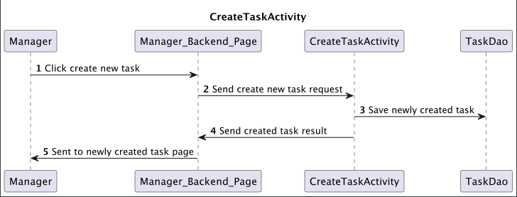
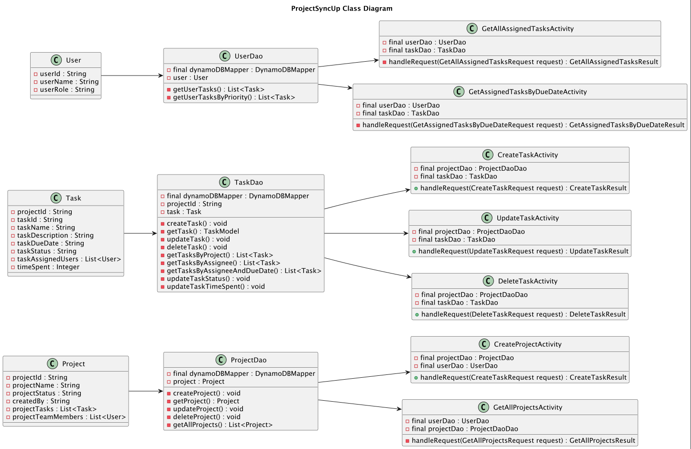

# Design Document

## ProjectSyncUp Design

## 1. Problem Statement

_The objective of this project is to create a web application using Java, that helps streamline collaboration among team members working on projects together. The app will allow managers to create projects and assign tasks, while team members can track, prioritize and update progress of their assigned tasks, resulting in an efficient tool that increases project transparency for teams while working together._

## 2. Project Scope

### 3. Use Cases

U1. As a manager, I want to create a new project with a given name.

U2. As a manager, I want to create a new, empty task with a given task name, description, due date, and list of assigned team members.

U3. As a manager, I want to add a task, to a project with a given name.

U4. As a manager, I want to update a task with different information.

U5. As a manager, I want to delete a task, that has been added to a project.

U5. As a manager, I want to view all projects I have created.

U6. As a team member, I want to view all tasks assigned to me.

U8. As a team member, I want to view all tasks assigned to me in ordered by due date.

U9. As a team member, I want to be able to update the progress of specific task (Not Started, In Progress, Complete).

### 4. Stretch Goals
U10. As a team member, I want to be able to track the amount of time I spend on each task in order to accurately bill for my work or manage my own productivity.

U11. As an Admin, I want to set roles for a user to be a team member or manager. 

U12. As a team member, I want to be able to comment on a specific task I am assigned to.

U13. As a manager, I want to be able to share and collaborate files and documents with my team.


## 5. Proposed Architecture Overview & APIs

### 5.1. Public Models

_Define the data models your service will expose in its responses via your *`-Model`* package. These will be equivalent to the *`PlaylistModel`* and *`SongModel`* from the Unit 3 project._

```
// ProjectModel
String projectId;
String projectName;
String projectStatus;
List<Task> projectTasks;
List<UserModel> projectTeamMembers;
```

```
// TaskModel
String projectId;
String taskId;
String taskName;
String taskDescription;
String taskDueDate;
String taskStatus;
List<UserModel> taskAssignedUsers;
Integer taskTimer;
```

```
// UserModel
String userId;
String userName;
String userRole;
```


### 5.2. _Create Project Endpoint_
* Accepts `POST` requests to `/projects`
* Accepts data to create a new Project with a given name, project status, and an optional list of tasks. Returns the new project, including a unique project ID assigned by the Project Management Service.
* Request Body: `{` <br>
    `"projectName": "Project Name",` <br>
    `"projectStatus": Not Started,` <br>
    `"projectTeamMembers": ["userId_1", "userId_2"]` <br>
    `}`


### 5.3. _Create Task Endpoint_
* Accepts `POST` requests to `/tasks`
* Accepts data to create a new Task with a given task name, description, due date, task status, and list of assigned team members. Returns the new Task, including a unique task ID assigned by the Project Management Service.
* Request Body: `{` <br>
  `"projectId": "01",` <br>
  `"taskName": "Task Title",` <br>
  `"taskDescription": "Task Description",` <br>
  `"taskAssignedUsers": ["userId_1", "userId_2"],` <br>
  `"taskStatus": "Not Started",` <br>
  `"taskDueDate": "yyyy-mm-dd",` <br>
  `"taskTimer": 50` <br>
  `}`




### 5.4. _Update Task Information Endpoint_
* Accepts `PUT` requests to `/tasks/:id`
* Accepts a task ID and updated task information, Returns the updated the task with the new information.
    * If the given task ID doesn't exist, will throw an ``TaskNotFoundException``
* Request Body: `{` <br>
  `"projectId": "01",` <br>
  `"taskName": "New Title",` <br>
  `"taskDescription": "Updated Task Description",` <br>
  `"taskAssignedUsers": ["userId_1", "userId_2"],` <br>
  `"taskStatus": "Not Started",` <br>
  `"taskDueDate": "yyyy-mm-dd",` <br>
  `"taskTimer": 50` <br>
  `}`

### 5.5. _Delete Task From Project Endpoint_
* Accepts `DELETE` requests to `/tasks/:id`
* Accepts a task ID, deletes the task with that ID from project.
    * If the given task ID doesn't exist, will throw an ``TaskNotFoundException``

### 5.6. _View All Projects Endpoint_
* Accepts `GET` 
* Accepts a user ID, returns a list of projects created by that Manager.
    * If the given project ID doesn't exist, will throw an ``ProjectNotFoundException``
    * If the given Manager has not created any projects, an empty list will be returned

### 5.7. _View All Assigned Tasks Endpoint_
* Accepts `GET` 
* Retrieves a list of all tasks assigned to given user ID.
* Accepts a user ID, returns a list of all tasks assigned to that user.
    * If the given user ID doesn't exist, will throw an ``UserNotFoundException``
    * If the given user does not have any tasks, an empty list is returned.

### 5.8. _View Assigned Tasks By Due Date Endpoint_
* Accepts `GET`
* Retrieves a list of all tasks assigned to given user ID.
  * Returns the task list in default project order (Most Recent)
    * If the optional order parameter is provided, this API will return the task list in ``order``, reverse order, or by Due Date, based on the value of ``order``
      * DEFAULT - same as default behavior, returns tasks in ordered assigned by Manager (Most Recent)
      * REVERSED - returns project tasks in reversed order 
      * DUEDATE - returns project tasks in order of due date.
  * If the given project ID is found, but contains no tasks, the tasks list will be empty
  * If the given project ID doesn't exist, will throw an `ProjectNotFoundException`

## 6. Tables
### 6.1. `projects`
```
projectId // Partition Key, String
projectName // String
projectManager // String
projectStatus // String
projectTeamMembers // List<String>
```

### 6.2. `tasks`
```
projectId // Sort Key, String
taskId // Partition Key, String
taskName // String
taskDescription // String
assignedTo // List<String> userId-assignedTo-index partition key
dueDate // String userId-assignedTo-index sort key
status // String
timeSpent // Number
```

### 6.2. `users`
```
userId // Partition Key, String
userName // String
userRole // String
```
## 7. Design Diagram

## 8. Pages
- Login Page
- Manager Homepage
- Team Member Homepage
- [Wire Frame](https://www.figma.com/file/6vq0CO2AfrBKIRMwxEdqRr/Project-Management-App?node-id=0%3A1&t=NWXwFL60VY3kkXQx-1)
